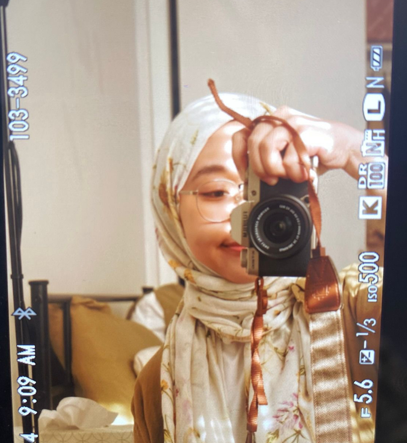

# About Me

Hi there! 👋🏼

I'm Putri, an adult language educator with passion for civic engagement, education technology and UX/UI Design. I received my master degree in Educational Linguistics from University of Pennylvania Graduate School of Education, with a focus on second language development, universal design for learning, and technology. 

I am passionate in facilitating adult learners to learn language skills they need to empower them. I taught at grassroots community-based programs to develop and teach ESL for refugees and immigrants. In the Summer 2022, I started a position as a Digital Humanities Project Management Assistant at Penn Price Lab until my graduation day, where I managed multiple projects and collaborated with the team to deployed scholarships project websites.

Few years ago, I worked at an ed-tech start-up, CoLearn, where I assisted in the development of online mobile apps delivering STEM courses for K1-K12 learners for almost three years. 

Currently I'm still teaching while developing my interest in Project Management and UX Research as a language educator.

Thanks for stopping by!

