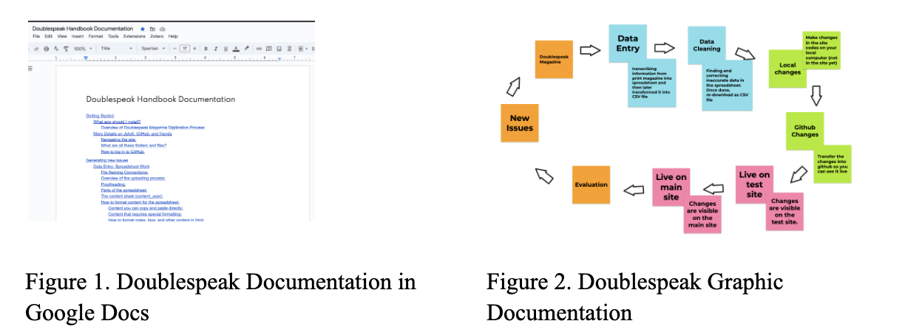
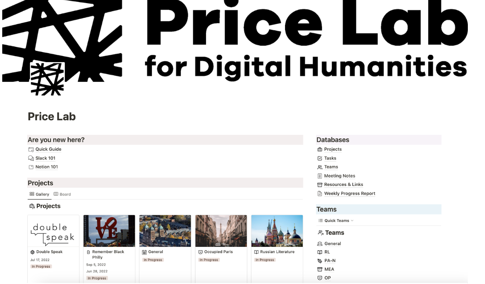

Starting a project is one thing, while maintaining its workflow is another. My experiences as a teacher who is required to plan lessons, manage students, and communicate with various stakeholders such as parents and school staff have become a valuable skill for me in project management. My years of experience in the classroom highlighted the importance of clear technical documentation, over-communication, and centralizing resource management when I was assigned to be a Project Manager (PM) for Digital Humanities projects at Price Lab and Penn RDDS.

## Technical Documentation: The Key to Sustaining Projects

Digital humanities projects are exciting and innovative. However, ensuring the long-term sustainability of such projects can be daunting, especially in higher education, where students may graduate, and the faculty leadership may rotate after several terms. Documentation functions as a bridge from one stakeholder to another to work on the project. Without proper documentation, ongoing projects might be disconnected from the changing people and times, left under the rugs, and neglected. Someone can be an institutional knowledge, yet transferring it to documentation will ensure everyone responsible can continue the progress. 

So how does documentation solve the disconnect between humans and projects?
I think the purpose of composing technical documentation is similar to teaching and creating an instructional design: making complex information accessible and understandable to non-experts. To begin, let us dissect what technical documentation is. Documentation is a technical script—how-to, description, tutorials—which have details about a product or a project that is either under development or already completed. The project/product lead, the project manager, or the whole team could write it. Typically, documentation consists of organized information about the project and logical structures for maintaining or how to work on the project.

It is essential to always think of who will be the audience of the documentation. In documentation writing, the presupposition is that the readers have never worked on such a project before. Therefore, it will ensure we compose documentation contextually, elaboratively, and precisely. It is also important to note that the audience might have different access needs. That is, they might need or need or prefer certain types of information processing modes, which could be addressed by providing multimodal documentation. Below are some examples of documentation with different file modes in Digital Humanities projects at Price Lab and RDDS

Using [GitHub](https://github.com/) is another efficient approach to handling documentation and workflows. [GitHub](https://github.com/) is a collaborative software development platform that permits users to establish and manage repositories to keep project files and documentation in one place. GitHub can also be used for site deployment, which means that we can host and publish the website directly from the GitHub Repository. I work for both [Doublespeak Magazine](https://www.doublespeakmagazine.org/) and [Remember Black Philly](https://rememberblackphilly.com/), which both projects are hosted and deployed from Github. Inside the repository, we have important files that will help the content be visible on the world wide web, such as the code script files and any other assets, such as images, audio, or videos. It is also essential to use clear and consistent naming conventions for files and folders to make it easier for users to navigate the repository. 

Documentation functions as a guide for projects to direct the person in charge in guaranteeing their sustainability amid personnel transitions and evolving times. 

## Overcommunication in a Hybrid World

The COVID-19 pandemic essentially shifted the way people communicate from in-person to shift to online meetings and hybrid works. In working for the DH projects at Price Lab and Penn RDDS that involve multiple stakeholders with different bandwidths, from faculties to students, flexibility and open communication become essential to keeping the project going. In a hybrid work environment, it is always more critical to over-communicate than to under-communicate. Over-communicate does not equal sending spam messages to other stakeholders. It means we articulate expectations, caveats, and contexts and provide different means of communication. In managing the projects throughout the Summer, we use several communication tools beyond synchronizing in-person meetings. We use Slack, Zoom, and email correspondence to get our points across. 

We first use [Slack](https://www.slack.com), an instant messaging program for professional and organizational communications. It is used for quick updates and questions during asynchronous work, and chats are expected to be answered within 2-3 days before our weekly check-ins. Besides text-based communication, [Slack](https://www.slack.com) allows us to use emojis to confirm or affirm statements or questions posted on the server. With less formality than email, [Slack](https://www.slack.com) gives us room to communicate with flexibility and real-time messaging that helps us progress throughout the process. The second tool we use is [Zoom](https://zoom.us/). It is used when the members are unavailable to meet in person, which functions similarly to a meeting room. [Zoom](https://zoom.us/) has become the new normal in a workspace, making synchronous work accessible as long as we are wired to the internet. Lastly, we use email to correspond. Email functions not only as a more extended, formal communication tool but also as a memo for decisions made or to attach essential documents that otherwise will be lost in verbal discussions. Overall, each communication space offers a very vibrant way of communication that serves different objectives. It is up to us as users to utilize the options available to best serve our needs.

## Centralizing Resources

In digital humanity, where most of the assets are digital—although not always—storage locations are sometimes sporadic. Considering the constant changes of stakeholders, it is expected that members might have preferred ways to store assets. However, when it comes to sustaining the projects where a new person might take charge, the existing files are inaccessible, which could hinder the projects’ progress. Therefore, one of the critical elements in streamlining project management of DH projects is establishing a centralized resources space. 

We can utilize several tools to manage digital resources in DH projects. A few that are used during my role are [Airtable](https://www.airtable.com/) and [Notion](https://notion.so). [Airtable](https://www.airtable.com/) is a versatile online platform combining spreadsheet and database functionalities. It has a spreadsheet-like layout and the ability to store various data types, sort, filter, and collaborate, so [Airtable](https://www.airtable.com/) lays the foundation for effective project management. 

I work with other students for the DH projects and need to track minuscule tasks per project, which is challenging to do in [Airtable](https://www.airtable.com/). Therefore, I used [Notion](https://notion.so) as a support tracking and monitoring tool. [Notion](https://notion.so) is an integrating note-taking, databases, and project management in a single interface. By leveraging [Notion](https://notion.so).  flexibility and customization options, we can optimize workflows and streamline project execution. Other alternative project/product management platforms I used in my industrial works are [Jira](https://www.atlassian.com/software/jira), [Trello](https://trello.com/), and [Asana](https://asana.com). These tools offer seamless project and product management functionalities, ensuring deliverables, work scope, and accountability are tracked and documented. With [Notion](https://notion.so) serving as a free alternative for students, its suitable working space templates make it an ideal choice for managing DH projects. 

# Conclusion

That's my two cents on how I managed the multiple DH projects during my time at [Penn Price Lab](https://pricelab.sas.upenn.edu/). Hope you find it useful.
